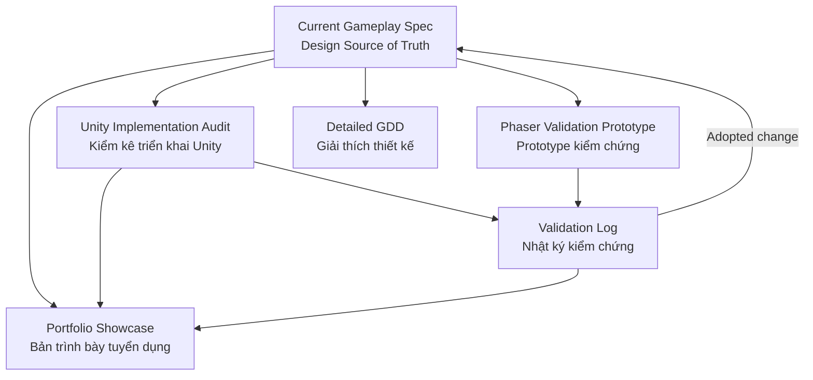

> **Mirror notice:** Git snapshot of the Notion page above. Notion remains authoritative unless project policy changes. Notion-native tags are preserved for fidelity.

# 00 — Beast Link Battle — Current Gameplay Spec v2

> **Design Source of Truth (nguồn sự thật thiết kế).** This page defines the current intended gameplay rules for Beast Link Battle. Unity, Phaser and portfolio materials should map to these Rule IDs rather than redefining the rules themselves.
**Version:** v2  
**Baseline date:** 2026-10-01  
**Status:** P1 structural baseline — adopted design direction, not yet synchronized to Unity/Phaser and not yet player-validated.
## How to Use This Spec
- A rule marked **Baseline** is the current intended prototype rule.
- **Needs Validation (cần kiểm chứng)** means the rule is usable as the current baseline but has not been validated by player data.
- **Open Decision (quyết định còn mở)** means the design is intentionally unresolved.
- **Design Direction (hướng thiết kế)** is not part of the current gameplay baseline.
- Test variants in Phaser or another prototype do **not** change this page until the variant is explicitly adopted.
- When an adopted rule changes, implementation documents should be marked **Needs Sync (cần đồng bộ)** until updated.
## Document Flow (luồng tài liệu)

## Current Gameplay Rules
<table fit-page-width="true" header-row="true">
<tr>
<td>Rule ID</td>
<td>Category</td>
<td>Current Rule</td>
<td>Decision State</td>
<td>Notes</td>
</tr>
<tr>
<td>FLOW-001</td>
<td>Core Loop</td>
<td>Deck Setup → Beast Rush → Energy Rush → Battle Setup / Beast Arrangement → Auto Battle + Timed Energy Cast → Result / Wave Transition → Next Cycle.</td>
<td>Baseline · Needs Validation</td>
<td>P1 structural baseline. Puzzle collection happens before Battle; active Battle focuses on Beast arrangement consequence and Energy cast timing.</td>
</tr>
<tr>
<td>DECK-001</td>
<td>Loadout</td>
<td>Player enters a level with one Leader Pet plus selected Beast and Energy definitions.</td>
<td>Baseline</td>
<td>Current deck system supports up to 5 Beasts and 5 Energies.</td>
</tr>
<tr>
<td>PUZ-001</td>
<td>Puzzle</td>
<td>Current playable board baseline is 6×6.</td>
<td>Baseline · Needs Validation</td>
<td>Current prototype configuration, not a permanent rule for every future level.</td>
</tr>
<tr>
<td>PUZ-002</td>
<td>Puzzle</td>
<td>Pathfinding may use a one-cell outer runtime border around the playable board.</td>
<td>Baseline</td>
<td>Supports outer U-style routing.</td>
</tr>
<tr>
<td>PUZ-003</td>
<td>Board Generation</td>
<td>Initial board content is generated in matching pairs.</td>
<td>Baseline</td>
<td>If playable-cell count is odd, one cell may be blocked.</td>
</tr>
<tr>
<td>MATCH-001</td>
<td>Onet Match</td>
<td>A valid match requires two different occupied positions with matching content and a valid Onet path using at most 2 turns.</td>
<td>Baseline</td>
<td>Straight, L, Z-style and U-style paths are supported.</td>
</tr>
<tr>
<td>PHASE-001</td>
<td>Beast Rush</td>
<td>The first pre-Battle puzzle phase uses Beast-only content. Successful matches accumulate Beast Queue output before combat.</td>
<td>Baseline · Needs Validation</td>
<td>Fast Onet scanning and board luck may remain part of this phase; strategic role expression is expected to become clearer in Battle Setup.</td>
</tr>
<tr>
<td>COMBO-001</td>
<td>Combo</td>
<td>The first valid match activates the Combo window.</td>
<td>Baseline</td>
<td>Every successful match registers with Combo.</td>
</tr>
<tr>
<td>COMBO-002</td>
<td>Combo</td>
<td>Initial Combo time = 5.0 seconds.</td>
<td>Baseline · Needs Validation</td>
<td>Current prototype tuning.</td>
</tr>
<tr>
<td>COMBO-003</td>
<td>Combo</td>
<td>Each successful match adds +0.3 seconds.</td>
<td>Baseline · Needs Validation</td>
<td>Current prototype tuning.</td>
</tr>
<tr>
<td>COMBO-004</td>
<td>Combo</td>
<td>Combo time cap = 5.0 seconds.</td>
<td>Baseline · Needs Validation</td>
<td>Current prototype tuning.</td>
</tr>
<tr>
<td>QUEUE-001</td>
<td>Battle Queue</td>
<td>A successful Beast match adds +1 count for that Beast definition to the Battle Queue.</td>
<td>Baseline</td>
<td>Matching does not immediately spawn a battlefield unit.</td>
</tr>
<tr>
<td>RES-001</td>
<td>Battle Setup</td>
<td>After Beast Rush and Energy Rush are complete, the flow enters Battle Setup before active combat.</td>
<td>Baseline · Needs Validation</td>
<td>Battle Setup is the bridge from both pre-Battle queues to tactical combat.</td>
</tr>
<tr>
<td>RES-002</td>
<td>Battle Setup</td>
<td>Battle Setup converts Beast Queue output into units, allows the player to arrange those units on battlefield slots, shows stored Energy output, and provides Start Battle.</td>
<td>Baseline · Needs Validation</td>
<td>Player Agency should come from formation/role arrangement rather than only pressing a continuation button.</td>
</tr>
<tr>
<td>STAR-001</td>
<td>Star Conversion</td>
<td>Queue conversion uses 1 / 3 / 9: 1 queue count → 1★, 3 → 2★, 9 → 3★.</td>
<td>Baseline · Needs Validation</td>
<td>Adopted design rule. Current Unity individual resolution matches it; Unity full-queue resolution still needs sync from 2 / 6 / 18.</td>
</tr>
<tr>
<td>PHASE-002</td>
<td>Energy Rush</td>
<td>The second pre-Battle puzzle phase uses Energy-only content. Successful matches accumulate Energy Queue output for later Battle use.</td>
<td>Baseline · Needs Validation</td>
<td>Energy is collected before active combat; there is no puzzle matching during the P1 Battle baseline.</td>
</tr>
<tr>
<td>ENERGY-001</td>
<td>Energy Queue</td>
<td>A successful Energy match adds stored output for that Energy definition to the pre-Battle Energy Queue.</td>
<td>Baseline · Needs Validation</td>
<td>Exact match-to-charge conversion is intentionally open for the first P1 implementation variant.</td>
</tr>
<tr>
<td>ENERGY-002</td>
<td>Energy Queue</td>
<td>Stored Energy remains available through Battle Setup and becomes a finite Battle resource rather than an active-Battle puzzle gauge.</td>
<td>Baseline · Needs Validation</td>
<td>P0 +10 / max20 remains implementation history, not the P1 structural rule.</td>
</tr>
<tr>
<td>ENERGY-003</td>
<td>Energy Skill</td>
<td>During active Battle, the player may consume stored Energy Queue charges to execute the corresponding Energy skill at a chosen time.</td>
<td>Baseline · Needs Validation</td>
<td>Battle continues even if the player does not cast. Skill timing should create a meaningful trade-off; exact effects remain separate tuning decisions.</td>
</tr>
<tr>
<td>ROLE-001</td>
<td>Beast Roles</td>
<td>Beast role identity must be readable in Battle Setup and affect combat/position value. Current role vocabulary is Tanker / Assassin / Ranger / Mage.</td>
<td>Baseline · Needs Validation</td>
<td>Exact numerical role balance is not yet adopted.</td>
</tr>
<tr>
<td>BATTLE-001</td>
<td>Auto Battle</td>
<td>After Start Battle, combat progresses autonomously without puzzle input. Player and enemy combat state continue changing even if the player gives no input.</td>
<td>Baseline · Needs Validation</td>
<td>Inaction must have a visible consequence; Battle must not wait for Energy matching.</td>
</tr>
<tr>
<td>BATTLE-002</td>
<td>Formation</td>
<td>Before active combat, the player arranges converted Beast units on battlefield slots. Position should interact with Beast role.</td>
<td>Baseline · Needs Validation</td>
<td>Mid-combat reposition is an Open Decision; first P1 prototype may lock positions after Start Battle.</td>
</tr>
<tr>
<td>WAVE-001</td>
<td>Wave Flow</td>
<td>After a wave resolves, the game transitions toward the next preparation cycle; the final resolved wave ends the level.</td>
<td>Baseline</td>
<td>Current wave content values remain prototype data.</td>
</tr>
<tr>
<td>FAIL-001</td>
<td>Failure</td>
<td>If the player's active army is defeated while enemies remain, the Battle can end in defeat.</td>
<td>Baseline · Needs Validation</td>
<td>Because Battle advances autonomously, failure can occur even if the player chooses not to cast stored Energy.</td>
</tr>
<tr>
<td>DEADLOCK-001</td>
<td>Puzzle Safety</td>
<td>The playable puzzle flow should recover from a state with no reachable valid match instead of trapping the player.</td>
<td>Baseline Requirement</td>
<td>Implementation is not yet fully wired in Unity.</td>
</tr>
<tr>
<td>PET-001</td>
<td>Leader Pet</td>
<td>Leader Pet can modify compatible Beast combat stats through element-filtered HP / Damage multipliers.</td>
<td>Baseline</td>
<td>A separate Pet Base combat entity is not part of the current baseline.</td>
</tr>
<tr>
<td>DIR-001</td>
<td>Alternative Design</td>
<td>Mixed Beast + Energy on the same board is a comparison concept, not the current gameplay rule.</td>
<td>Design Direction</td>
<td>May be tested later if phase separation creates a demonstrated design problem.</td>
</tr>
<tr>
<td>DIR-002</td>
<td>Alternative Design</td>
<td>A separate Pet Base combat anchor is not part of the current gameplay baseline.</td>
<td>Design Direction</td>
<td>Preserved only as an earlier concept.</td>
</tr>
</table>
## Change Control (quy trình thay đổi)
A design change should follow:
**Validation Finding (kết quả kiểm chứng) → Design Proposal (đề xuất thiết kế) → Test Variant (biến thể thử nghiệm) → Decision → Adopt / Reject**
If **Adopted**:
1. Update the affected Rule ID on this page.
2. Record the version/date change.
3. Mark Unity / Phaser mappings that still use the old rule as **Needs Sync**.
4. Update recruiter-facing portfolio material only after the new rule is represented correctly.
If **Rejected**:
- Keep this spec unchanged.
- Archive the test result in the Validation Log.
## Open Decisions & Validation Targets
- **STAR-001:** remains adopted at **1 / 3 / 9**; validate army growth and how star tier interacts with formation/roles.
- Validate whether **COMBO-002 / 003 / 004** should remain unchanged for Beast Rush or become a P1 timing variant.
- Define the exact termination/timing rule for **Energy Rush**.
- Define exact Energy match → queued charge conversion for **ENERGY-001 / 002**.
- Validate whether **ROLE-001 + BATTLE-002** makes Beast arrangement meaningfully readable.
- Validate whether **BATTLE-001** creates clear consequence when the player gives no input.
- Validate whether **ENERGY-003** creates meaningful cast timing rather than immediate mandatory use.
- Decide whether mid-combat Beast reposition is needed after the first P1 validation build.
## Related Documents
- Unity implementation state: **Unity Implementation Audit**.
- Design explanation and rationale: **Beast Link Battle — Detailed GDD / Working Docs**.
- Recruiter-facing communication: **Beast Link Battle — Portfolio Showcase**.
- Experimental implementation: <mention-page url="https://app.notion.com/p/3ec2674d32c38155a07ec449ad9f9ea2"/>.
- Player evidence: **Validation Log (nhật ký kiểm chứng)**.
- Adopted P1 structural decision: <mention-page url="https://app.notion.com/p/3ec2674d32c381e3bdb8fe9d409516f0">00.2 — Decision Record — P1 Dual-Queue Core Loop</mention-page>.
<page url="https://app.notion.com/p/3ec2674d32c3817297d6f63a81f120a1">00.1 — Decision Record — STAR-001 Queue → Star Conversion</page>
<page url="https://app.notion.com/p/3ec2674d32c381e3bdb8fe9d409516f0">00.2 — Decision Record — P1 Dual-Queue Core Loop</page>
